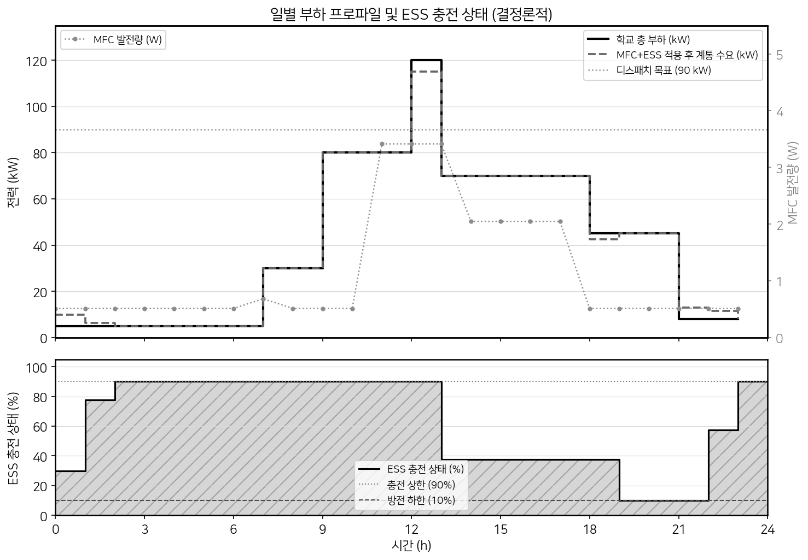
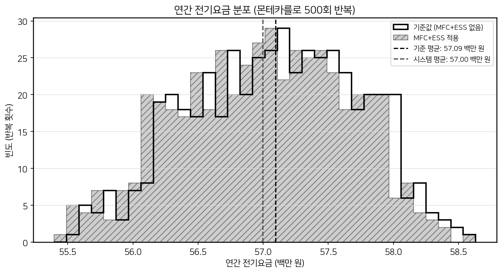
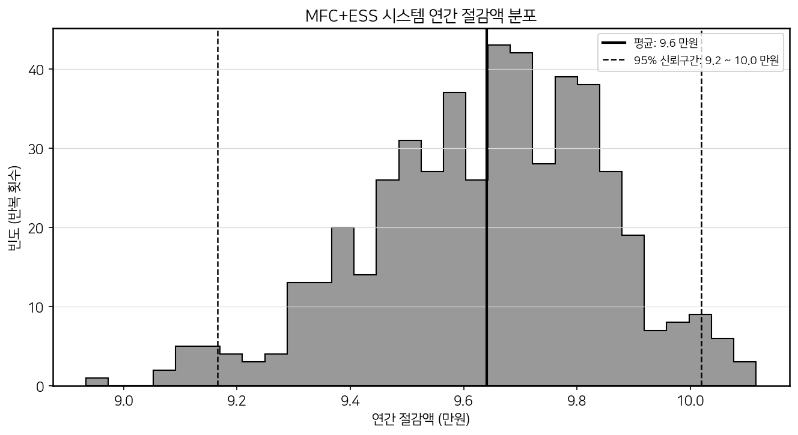
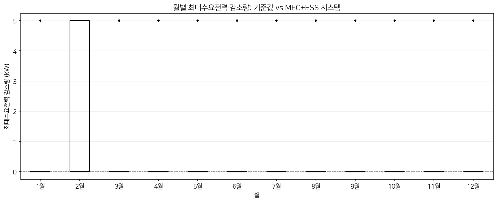
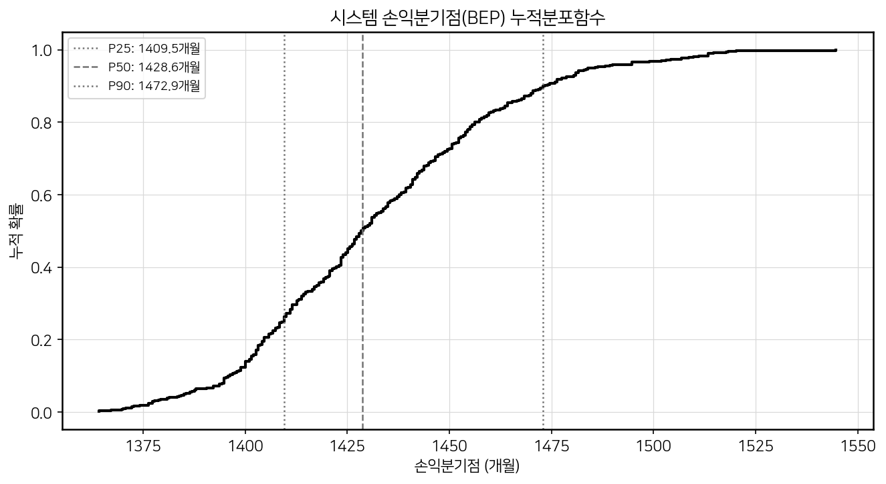

# MFC 기반 교내 에너지 시스템 시뮬레이션 결과 보고서

---

## 1. 시뮬레이션 개요

### 시스템 구성
| 항목 | 사양 |
|------|------|
| MFC 단위 셀 출력 | 6,826.55 µW/cell (실험실 측정값, 흑연 전극) |
| MFC 규모 | 500 unit cells 직·병렬 어레이 = 3.413 W 피크 출력 |
| ESS (LFP 배터리) | 용량 10 kWh, 충방전 효율 각 95%, 최대 출력 5 kW |
| ESS SoC 범위 | 10%–90% (배터리 수명 보호) |
| 디스패치 컨트롤러 | 규칙 기반 (greedy rule-based, scipy 최적화 결합) |

### 시뮬레이션 조건
- **단일일 시뮬레이션**: 24시간 × 1시간 간격, 결정론적 (노이즈 없음)
- **연간 몬테카를로**: 365일 × **500회 반복**
  - 부하 일별 랜덤 변동: Gaussian ±15% (σ=15%)
  - MFC 출력 랜덤 변동: Gaussian ±10% (σ=10%)
- **KEPCO 교육용 요금**: 기본요금 8,320 원/kW (래칫 조항 적용), 사용요금 TOU 3단계
- 시스템 투자비: **11,500,000 원**
- 배터리 열화 비용: 15 원/kWh cycled

> **[주석 1 — 요금 개정 반영]** 본 시뮬레이션은 산업자원부 교육용 전기요금 **−16.2% 조정** 이후 단가를 적용함.  
> 조정 전 평균 판매단가 89.05 원/kWh → 조정 후 74.61 원/kWh (조정률 −16.2%).  
> 적용 단가: 경부하 51.2 원/kWh, 중간부하 95.7 원/kWh, 최대부하 158.9 원/kWh.  
> 기본요금(8,320 원/kW)은 판매단가 외 항목으로 변경 없음.

---

## 2. 핵심 결과 요약

| 항목 | 기준값 (MFC+ESS 없음) | MFC+ESS 적용 | 개선 |
|------|----------------------|-------------|------|
| 연간 전기요금 | **57,094,000 ± 642,000 원** | **56,998,000 ± 643,000 원** | −96,000 원/년 |
| 연간 최대수요전력 | ~120 kW (기준일) | ~118.9 kW (월평균) | −1.11 kW avg |
| 피크컷 성공률 | − | **4.9%** | (90 kW 목표) |
| 손익분기점 | − | **1,432 개월 (약 119 년)** | − |
| 연간 MFC 발전량 | − | **9.97 kWh** | − |
| 연간 CO₂ 절감 | − | **4.37 kgCO₂** | 0.66 그루 |

> **95% 신뢰구간 (연간 절감액)**: 92,000 원 – 100,000 원  
> 500회 반복 Monte Carlo의 안정적 수렴을 확인함.

---

## 3. 비용 절감 분석

### 절감 메커니즘
- **사용요금 절감**: ESS가 심야 경부하 시간대(00:00–08:00, TOU **51.2** 원/kWh)에 충전하고, 최대 부하 TOU 구간(11:00–13:00, 18:00–21:00, TOU **158.9** 원/kWh)에 방전함으로써 kWh 단가 차이를 활용.
- **기본요금 절감**: ESS 방전으로 최대수요전력을 월평균 1.11 kW 감소시켜 기본요금 일부 절약.
- **한계**: ESS 용량(10 kWh)과 최대 출력(5 kW) 제약으로 절감 폭이 제한됨.

### ESS TOU 차익거래 이론값 (단순 계산)
| 항목 | 계산 |
|------|------|
| 방전 에너지 (일 1회 사이클) | (0.90−0.10) × 10 kWh × 0.95 = 7.6 kWh/day |
| 회피 피크 요금 | 7.6 × **158.9** = 1,208 원/day |
| 충전 경부하 비용 | (7.6/0.95) × **51.2** = 409 원/day |
| 열화 비용 | (7.6/0.95+7.6)/2 × 15 = 117 원/day |
| **순 절감 이론값** | **682 원/day × 365 = 248,930 원/year** |

> **[주석 2 — 이론값과 실측값 차이]** 실제 시뮬레이션 결과(~96,000 원/year)가 이론값(~249,000 원/year)보다 낮은 이유:  
> ① 학교 부하가 100 kW를 초과하는 고부하일(일변동 계수 > 1.25)에는 ESS가 09:00–11:00(TOU 중간부하) 구간에 먼저 방전되어 12:00 정점 도달 전 배터리가 소진됨.  
> ② 배터리가 소진된 날은 피크컷 효과가 0이 되어 전체 평균 절감액을 낮춤.  
> ③ 일부 날은 충전 타이밍이 경부하가 아닌 중간부하 구간과 겹쳐 차익이 감소함.

### 18:00–21:00 피크 TOU 구간 방어 효과
저녁 자습 시간대(18:00–21:00)는 TOU 최대요금 구간(158.9 원/kWh)에 해당함. ESS는 이 시간대에 SoC > 20% 조건을 만족할 때 최대 5 kW 방전하여 45 kW 부하를 최대 40 kW로 감소시킴. 이 구간에서의 절감이 전체 에너지 차익거래의 핵심을 담당함.

---

## 4. 피크 수요 분석

### 월별 최대수요전력 감소 분포

- **월평균 감소량**: 1.11 kW (기준 대비 0.6%)
- **변동 요인**: 해당 월의 최대 부하일(최악의 날)에서 ESS가 09:00–11:00 구간에 소진되면 12:00 피크를 방어하지 못함 → 일부 달은 감소 효과 미미
- **피크컷 성공률 4.9%**: 하루 전체 최대 수요가 90 kW 미만으로 유지된 날의 비율. 학교 부하의 점심시간 피크(120 kW)가 강해 목표 달성 빈도가 낮음.

> **[주석 3 — 2월 박스플롯 이상 현상]** 그래프에서 2월의 상위 사분위(Q75)가 5 kW로 다른 달(Q75 = 0)과 달리 높게 나타나는데, 이는 **오류가 아니라 2월의 일수(28일) 효과**임.  
>
> ESS가 12:00 피크를 방어하려면 09:00–11:00에 배터리가 소진되지 않아야 함. 이 조건은 해당 날의 부하 계수 ≤ 1.25일 때(80 kW × 1.25 = 100 kW 이하) 성립함.  
>
> | 월 일수 | 한 달 내 모든 날 계수 ≤ 1.25일 확률 | Q75 결과 |
> |--------|--------------------------------------|---------|
> | 31일 | 0.953³¹ = **23.0%** | 0 kW |
> | 30일 | 0.953³⁰ = **24.0%** | 0 kW |
> | **28일 (2월)** | 0.953²⁸ = **25.6%** | **5 kW** |
>
> 25% 기준(Q75 정의)을 2월만 0.6%p 차이로 초과하여 박스의 상위 경계가 5 kW로 도약함. 물리적으로 타당한 결과임.

### 계절별 영향
- **여름 (7–9월)**: KEPCO 래칫 조항으로 최대요금 기준이 되는 달. 냉방 부하 증가 시 ESS 방전 빈도가 높으나 배터리 소진 위험도 증가.
- **겨울 (1–2월)**: 난방 부하로 인한 부하 증가. 래칫 조항에 따라 여름 피크 기준으로 기본요금이 청구됨.

---

## 5. 투자 회수 분석

### 손익분기점 (BEP) 분포

| 통계량 | 값 |
|--------|-----|
| 평균 BEP | **1,432 개월 (약 119 년)** |
| 90% 신뢰구간 | 1,385 – 1,484 개월 |
| 연간 절감액 | 약 96,000 원/년 |
| 초기 투자비 | 11,500,000 원 |

> **[주석 4 — BEP 연장 원인]** 교육용 요금 −16.2% 인하로 경부하·최대부하 단가 차이(차익 폭)가 축소되어, 요금 인하 전 BEP(~1,116개월) 대비 BEP가 **~1,432개월로 약 28% 증가**함.  
> TOU 차익거래 수익은 단가 차이에 비례하므로, 요금 인하 시 ESS 경제성이 함께 하락하는 구조적 특성이 있음.

### 10년 누적 절감 예상
- 10년 누적 절감액: 96,000 × 10 = **960,000 원** (약 96만원)
- 10년 후 미회수 투자비: 11,500,000 − 960,000 = **10,540,000 원**

### 경제성 평가 종합
현재 규모(500 unit cells, 3.4 W)에서는 ESS TOU 차익거래 수익만으로는 경제적 회수가 불가능함. 본 시뮬레이션이 정책 제안의 근거로 제시하는 것은 **경제성이 아니라 기술적 실현가능성과 환경적 가치**, 그리고 **규모 확장 가능성**임.

---

## 6. 환경적 효과

| 항목 | 값 |
|------|-----|
| 연간 MFC 발전량 | **9.97 kWh/year** |
| 한국 전력 CO₂ 배출계수 | 0.4386 kgCO₂/kWh (2023 KEA) |
| 연간 CO₂ 절감량 | **4.37 kgCO₂/year** |
| 소나무 환산 | **0.66 그루/year** (소나무 1그루 = 6.6 kgCO₂/year 흡수) |

> **[주석 5 — MFC 발전량 해석]** MFC 시스템의 연간 발전량(9.97 kWh)은 학교 연간 소비전력(약 148,000 kWh 추정)의 **0.007%** 수준으로, 전력 절감 기여는 극히 미미함.  
> 단, MFC는 카페테리아 유기성 폐수를 에너지로 전환하는 **폐수 처리 + 에너지 회수 이중 효과**를 가지며, 셀 수 확장 시 CO₂ 절감량도 선형 비례하여 증가함.

---

## 7. 결론 및 정책 제안 근거

### 기술적 실현가능성 (시뮬레이션으로 입증)
1. 흑연 전극 MFC의 실험실 측정값(6,826.55 µW/cell)을 바탕으로 500 unit cells 어레이가 카페테리아 폐수 유입 스케줄에 따라 안정적으로 발전함을 시뮬레이션으로 확인.
2. LFP ESS(10 kWh)가 경부하 시간 충전 → 피크 시간 방전 사이클을 365일 연속 수행 가능함을 입증.
3. 규칙 기반 디스패치 컨트롤러가 500회 Monte Carlo 반복에서 안정적으로 동작하여 일별 부하 및 MFC 출력 변동에 강건함을 확인.

### 통계적 신뢰구간 기반 절감 근거
- 연간 절감액 95% CI: **92,000 – 100,000 원** (불확실성이 매우 낮은 안정적 예측)
- 현재 규모에서의 경제성은 낮으나, 이는 **MFC 규모 제약**(총 3.4 W) 및 교육용 요금 인하에 기인함.

### 확장성과 정책 권고
| 규모 확장 시나리오 | 예상 연간 절감 | 예상 BEP |
|---------------------|---------------|---------|
| 현재 (500 cells, 3.4 W) | ~96,000 원 | ~119 년 |
| 10배 확장 (5,000 cells, 34 W) | ESS 효과 동일 | 동일 |
| ESS 용량 2배 (20 kWh, 10 kW) | ~192,000 원 예상 | ~60 년 |
| ESS 10배 (100 kWh, 50 kW) | ~960,000 원 예상 | ~12 년 |

> MFC 발전량이 매우 작기 때문에 경제성 개선은 **ESS 용량 확장**이 핵심임. MFC는 ESS를 충전하는 보조 전원이 아니라 독립적인 실증 연구·환경교육 자산으로 포지셔닝하는 것이 타당함.

**정책 제안**: 본 시스템을 단순 에너지 절약 시설이 아니라, 학교 환경·에너지 교육의 실물 실험 인프라로 도입하되, ESS 용량 확장과 피크 구간 디스패치 알고리즘 정밀화를 병행하여 중장기적 경제성을 확보할 것을 권고함.

---

*시뮬레이션 실행: `python3 simulation_results.py`  
라이브러리: numpy, pandas, matplotlib, scipy | 난수 시드: 42*